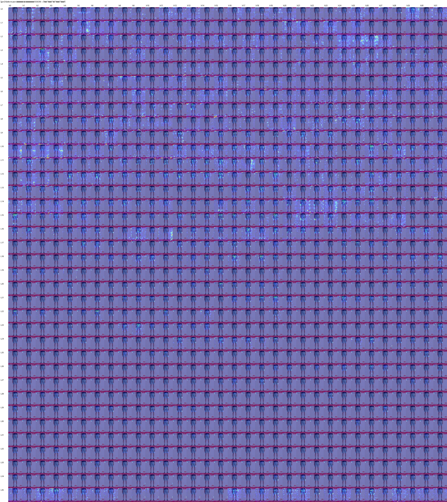
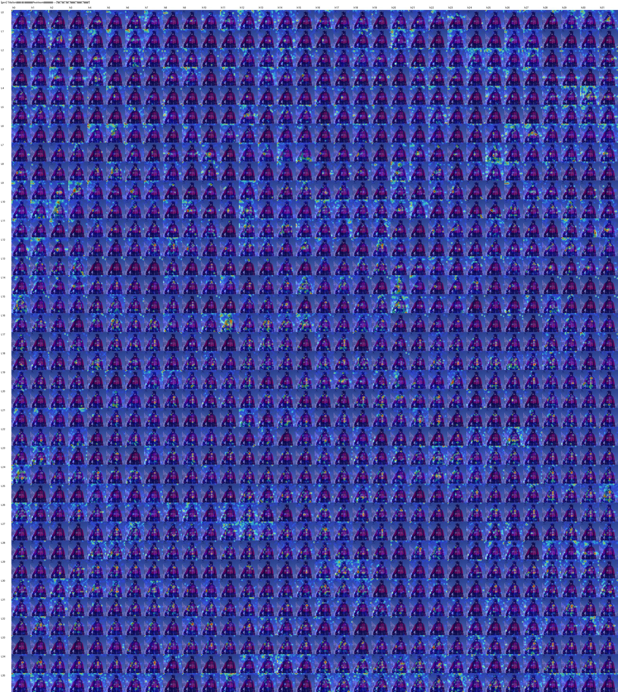
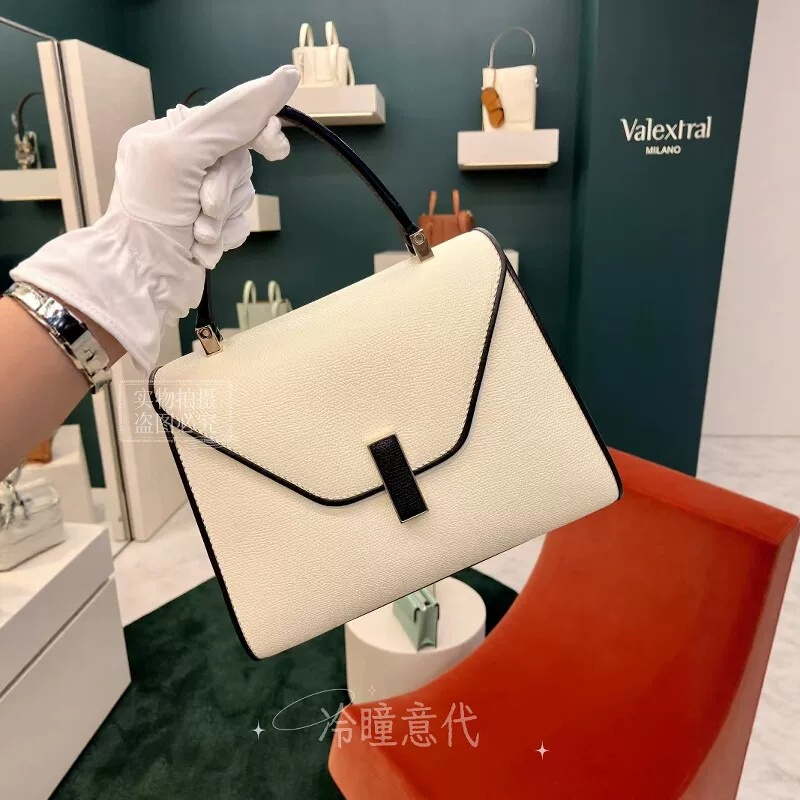
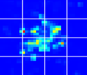

# EcomFactor

A lightweight multimodal model for extracting **visually grounded product factors** from noisy e-commerce image-title pairs.

This project distills the product-region grounding and visible-factor recognition ability of a large vision-language model into a compact task-specific model. It is designed for large-scale e-commerce product understanding, where product images and titles are often noisy, redundant, and expensive to annotate manually.

---

## Overview

E-commerce product pages usually contain noisy and weakly structured data. Product images may include white backgrounds, human models, watermarks, decorative objects, multiple products, or irrelevant background regions. Product titles often contain SEO phrases, brand claims, model numbers, campaign information, shipping terms, and non-visual marketing descriptions.

For downstream tasks such as product retrieval, clustering, trend mining, sales attribution, and recommendation explanation, we need reliable product visual factors such as:

```json
["卡其色", "格纹元素", "双排扣", "腰带", "毛呢/羊绒感"]
```

Large vision-language models can extract such factors with strong accuracy, but running them over millions or billions of product images is computationally expensive. This project asks:

> Can we transfer the product-grounding ability of a large vision-language model into a lightweight multimodal student model?

---

## Task Definition

Given:

* a product image;
* a noisy e-commerce title;
* optional noisy text-side candidate factors;

the model outputs a JSON-style list of visually salient product factors.

### Example

**Input title**

```text
2026新款Burberry风衣早秋长款男士外套官方正版英国代购
```

**Output**

```json
["卡其色", "格纹元素", "双排扣", "腰带", "毛呢/羊绒感"]
```

The model focuses on factors that are visible or visually inferable from the image, rather than all claims appearing in the title.

---

## Teacher Attention Analysis

We first run a large vision-language teacher model, `Qwen3.5-VL-8B-Instruct`, on a large-scale self-collected e-commerce image-title dataset containing more than one million samples. The teacher is prompted to output visually salient factors of the product described by the title.

In addition to using the teacher-generated factor labels, we further analyze the teacher model's internal attention behavior. During factor generation, we use hooks to collect attention distributions from different layers and heads, especially the attention from generated factor tokens to image tokens.

We observe that a small subset of heads consistently focuses on the main product region across noisy e-commerce images, including white-background product photos, model-worn images, decorative scenes, and multi-product layouts.

<p align="center">
  
  
</p>

<p align="center">
  <em>Figure 1. Layer-head attention visualization from the teacher model. Several heads consistently focus on image tokens corresponding to the main product region.</em>
</p>

Based on this observation, we select ten teacher heads with stable product-region grounding behavior and use them as weak spatial teachers for the student model.

---

## Attention-Map Distillation

For each selected teacher head, we extract the attention weights from generated factor tokens to image tokens. The attention values are restricted to the image-token subset, re-normalized within the image grid, and reshaped into a spatial attention map. The maps from selected heads are then aggregated into a consensus attention map.

This consensus map provides weak spatial supervision for the student Q-Former, encouraging it to attend to the product-relevant visual region rather than background, models, decorations, or unrelated objects.

<table>
  <tr>
    <td align="center" width="50%">
      
      <br>
      <em>Original product image</em>
    </td>
    <td align="center" width="50%">
      
      <br>
      <em>Consensus attention map from selected teacher heads</em>
    </td>
  </tr>
</table>

In this example, the aggregated attention map is concentrated on the handbag region, suggesting that the selected teacher heads provide meaningful localization cues for the target product.

---

## Model Architecture

The student model uses frozen visual and text encoders, followed by a two-stage Q-Former and an autoregressive factor decoder.

```text
Product image + noisy title
        │
        ├── Frozen DINOv2 Visual Encoder
        │       └── image patch tokens
        │
        ├── Frozen Chinese RoBERTa WWM Text Encoder
        │       └── title / noisy factor tokens
        │
        └── Two-stage Q-Former Fusion
                │
                ├── Stage 1: Text Denoising Q-Former
                │       └── denoised product-aware text queries
                │
                ├── Stage 2: Image Grounding Q-Former
                │       └── product-region grounded visual queries
                │
                └── Autoregressive Factor Decoder
                        └── visible product factor list
```

### Components

* **Frozen DINOv2 Visual Encoder**
  Extracts dense image patch tokens from product images.

* **Frozen Chinese RoBERTa WWM Text Encoder**
  Encodes noisy Chinese product titles and optional text-side candidate factors.

* **Stage 1 Text Denoising Q-Former**
  Reduces the influence of noisy title phrases such as marketing terms, model numbers, logistics information, and non-visible claims.

* **Stage 2 Image Grounding Q-Former**
  Grounds product-aware queries onto DINOv2 image tokens and learns from teacher-derived attention maps.

* **Autoregressive Factor Decoder**
  Generates the final structured factor list.

---

## Training Objective

The model is trained with two main supervision signals.

### 1. Semantic Factor Distillation

The decoder learns to reproduce the teacher-generated visible product factors:

```text
image + title → teacher factor list
```

### 2. Attention-Map Distillation

The Stage 2 Q-Former attention maps are encouraged to align with the teacher-derived product-region consensus maps.

The overall objective is:

```text
L = L_factor_generation + λ · L_attention_map_distillation
```

where `L_factor_generation` supervises textual factor generation, and `L_attention_map_distillation` transfers the teacher model's spatial grounding behavior.

---

## Quick Start

### Installation

```bash
git clone https://github.com/your-github-username/marqofactors_distillation.git
cd marqofactors_distillation
pip install -r requirements.txt
```

Recommended dependencies:

```text
torch
torchvision
transformers
safetensors
pillow
numpy
tqdm
```

### Python Inference

```python
from PIL import Image
from transformers import AutoModel

model = AutoModel.from_pretrained(
    "your-github-username/marqofactors_distillation",
    trust_remote_code=True,
)

image = Image.open("demo.jpg").convert("RGB")

factors = model.generate_factors(
    images=[image],
    titles=["2026新款Burberry风衣早秋长款男士外套官方正版英国代购"],
    pkuseg_factors=[["Burberry", "风衣", "长款", "男士外套", "英国代购"]],
)

print(factors[0])
```

Expected output:

```json
["卡其色", "格纹元素", "双排扣", "腰带", "毛呢/羊绒感"]
```

### Command Line Inference

```bash
python inference.py \
  --image demo.jpg \
  --title "2026新款Burberry风衣早秋长款男士外套官方正版英国代购" \
  --pkuseg_factors "Burberry,风衣,长款,男士外套,英国代购"
```

---

## Output Format

The model outputs a JSON-style list of visible product factors:

```json
[
  "黑色",
  "皮革纹理",
  "翻盖",
  "金属扣",
  "链条肩带",
  "logo"
]
```

Typical factor types include:

* color;
* material appearance;
* texture;
* pattern;
* product structure;
* logo or brand mark;
* decoration;
* visible functional parts;
* style and shape.

---

## Use Cases

* **Product retrieval**: use extracted factors as searchable structured attributes.
* **Product clustering**: group products by visual attributes rather than noisy title keywords.
* **Trend mining**: analyze popular colors, materials, structures, and design elements.
* **Recommendation explanation**: provide interpretable product-side visual factors.
* **Sales attribution**: combine extracted factors with price, sales, exposure, cost, and conversion data for downstream market analysis.

---

## Limitations

This model focuses on **visible or visually inferable product factors**. It should not be used alone to verify:

* product authenticity;
* real material composition;
* official brand legitimacy;
* seller credibility;
* manufacturing process;
* supply-chain-level attributes.

For example, the model may output `"羊绒感"` or `"毛呢质感"` based on visual appearance, but it cannot prove that the actual material is real cashmere without additional evidence such as OCR labels, official metadata, or seller-provided structured attributes.

---

## Roadmap

* [ ] Release pretrained weights in `safetensors` format.
* [ ] Add Hugging Face `from_pretrained` support.
* [ ] Add Gradio demo.
* [ ] Add normalized factor evaluation.
* [ ] Add human-verified benchmark set.
* [ ] Add attention heatmap visualization.
* [ ] Add evidence-aware factor verification.
* [ ] Add price / sales / cost based factor value estimation.

---

## Citation

```bibtex
@misc{shi2026marqofactors,
  title        = {marqofactors_distillation: Lightweight Multimodal Distillation for E-commerce Product Factor Extraction},
  author       = {Yonghao Shi},
  year         = {2026},
  howpublished = {\url{https://github.com/your-github-username/marqofactors_distillation}}
}
```

---

## License

This repository is released for research and educational use. Please check the license file for more details.

---

## Acknowledgements

This project is inspired by recent progress in vision-language models, multimodal distillation, Q-Former style architectures, and large-scale e-commerce product understanding.

